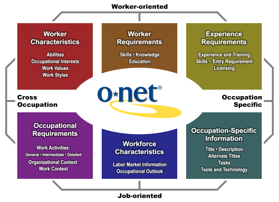

```{r setup, include=FALSE}

# laste inn standardbibliotek 
library(tidyverse)
library(readr)

# interaktive grafer
library(plotly)

# typografi fra visualiseringsguru nr 1, Edward Tufte 
library(tufte)
# invalidate cache when the tufte version changes
knitr::opts_chunk$set(
	message = FALSE,
	warning = FALSE,
	cache.extra = packageVersion("tufte"),
	tidy = FALSE
)
options(htmltools.dir.version = FALSE)

```


## Problemstilling

Hvilke personlige ferdigheter, interesser og personlighetstrekk har innvirkning på lønn i forskjellige yrker i Norge?

I denne utforskende dataanalysen sammenstilles spørreundersøkelsesdata som kartlegger hvilket nivå av ferdigheter, interesser, kunnskaper og hvilke personlige evner som er korrelert til lønnsnivå. Ettersom det ikke finnes detaljerte offentlige data fra norsk arbeidsliv som kartlegger dette, vil jeg sammenstille data om egenskaper ved utøvere av forskjellige yrker fra U.S. Bureau of Labor Statistics med norsk lønnsstatistikk fra SSB. Disse vil kobles sammen ved hjelp av [yrkesklassifiseringssystemet til FNs internasjonale arbeidsorganisasjon (ILO)](https://www.ilo.org/public/english/bureau/stat/isco/isco08/index.htm). Dette kategorisystemet (kalt ISCO-08) har kobligsnøkler mellom det norske og amerikanske kategorisystemet. 

## Forenklinger i modellen 
I denne undersøkelsen vil jeg gjøre enkelte forenklinger av virkeligheten:  

* Vi antar at personlige egenskaper knyttet til yrker i USA er lik tilsvarende yrke i Norge. For eksempel antar vi at en _[registered nurse](https://www.onetonline.org/link/details/29-1141.00)_ i USA har samme personlige egenskaper som en _[sykepleier](https://utdanning.no/yrker/beskrivelse/sykepleier)_ i Norge. Det er selvfølgelig forskjeller i arbeidslivskultur, næring, utdanningssystem og ledelse i arbeidslivet i USA og Norge, men for analysens skyld antar vi at yrkene er lik. Å samle inn et like omfattende datasett som det BLS i USA har gjort om det norske arbeidslivet vil koste flere titalls millioner, så da er det mer fruktbart å teste ut hypoteser basert på hypotesen om at amerikanske data er andvendbare. 

* Kategorisystemene for yrker har kategorier som i noen tilfeller for brede, og i andre tilfeller for spesialiserte. Dette ser vi bort fra i denne forenklede analysen. Vi vil koble sammen og regne gjennomsnittsverdier av egenskapene.   

U.S. Bureau of Labor Statistics har i flere tiår samlet inn omfattende statistikk om hvilke ferdigheter, kunnskaper, evner og interesser som er påkrevd i ulike yrker. 



Nettstedet [O\*Net Online](https://www.onetonline.org) videreformilder omfattende statistikk og beskrivelser knyttet til egenskaper ved de aller fleste vanlige yrker. Ingen opphavsrettslige begrensninger på offentlige nettsider fra USA. 

[O\*Net Online](https://www.onetonline.org) er et nettsted for detaljert faktaopplysninger og statistisk informasjon om nær 1000 yrker. Nettstedet har flere verktøy for å kunne sammenligne egenskaper ved forskjellige yrker. O*Net Online består av arbeidsmarkedsstatistikk og jobbegenskaper basert på offentlige registre og spørreundersøkelser blant fagfolk fra yrkets bransje og er utviklet i henhold til anerkjente karriereveiledningsteorier (f.eks. [Hollands RIASEC-modell](https://en.wikipedia.org/wiki/Holland_Codes)). Dataene har en fast redaksjonell syklus for faste oppdateringer. 

Karriereinformasjon som formidles for hver av 975 yrker gjennom nettstedet O*Net Online i USA (www.onetonline.org).


## Innhold i O*Net Online  
 
Type informasjon | Oversetting | Kort beskrivelse
------------- | -------------| -------------
Interests | interesser | Interesseprofil for ni interesser for hver av 950 yrker i henhold Holland-modell 
Knowledge | kunnskaper | Hvor viktig på en skala fra 0 til 100 et utvalg 65 forskjellige kunnskaper er i forskjellige yrker
Skills | ferdigheter | Betydningen av 70 forskjellige ferdigheter for utøvere av yrket
Abilities | evner | 52 fysiske egenskaper knyttet til yrket
Work Context | arbeidsmiljø | Betydning av forskjellige faktorer i utførelsen av arbeidet, minimums- og maksimumsverdier 
Work Styles | arbeidsmåter | Hvilke personlige egenskaper (av 16 forskjellige) som kreves 
Work Values | arbeidsaspekter | Hvilke av 9 psykologiske egenskaper som forventes av yrkesutøverne
Work Activities |  | Svært omfattende punktlister over typiske arbeidsoppgaver særskilt for yrket 
Job Zone |  | Hvor mye erfaring som forventes 
Education |  | Yrkets forventede utdanningsnivå basert på arbeidsmarkedsstatistikk 

# Dataimport

Datasett oppdateres hvert halvår 
https://www.onetcenter.org/database.html#individual-files 

U.S. Bureau of Labor Statistics publiserer hvert halvår alle sine data i flere format, database (MySQL, Oracle, MSSQL), tekst og regneark [onetcenter.org/database.html](https://www.onetcenter.org/database.html#individual-files). 

BLS-data kan importeres freskt til R fra tekstfilene på onetcenter.org. Men ettersom jeg allerede har gjort en import og oversettelse til norsk av kategorinavn og for kobling til norsk yrkeskategorisystem, vil jeg bentytte filer som stammer fra SQL-eksportene fra BLS. 

Men dersom filer skal importeres direkte fra onetcenter.org til R, vil en slik funksjon gjøre dirketeimport fra tekstfiler til tibbles: 

```{r curl_import, message=FALSE, warning=FALSE, paged.print=FALSE}

# importfunksjon 

# onet_data_ny <- tribble(~soc_code, ~element_id, ~element_name_nb, ~scale_id, ~data_value, ~date, ~domain_source) 
 
url1 <- "https://www.onetcenter.org/dl_files/database/db_23_1_text/Knowledge.txt"

# function for importing onet text files. 
import_onetcenterorg <- function(onet_url, onetcat) {
  onet_data <<- read_tsv(onet_url, 
    # more database friendly column names                     
    col_names = c("soc_code", "element_id", "element_name", 
                  "scale_id", "data_value", "date", 
                  "domain_source"),
      # strange date format e.g. 12/2018
      col_types = cols(
        date = col_date(format = "%m/%Y")
        # skip header row with column names
      ), skip = 1) %>% 
  # add onet indicator category as a variable, called onettype
  mutate(., onettype = onetcat)
}

import_onetcenterorg(url1, "knowledge") 

# View(onet_data)

```

# Koble data 

Følgende filer inneholder O*Net data og SSBs lønnstatistikk: 

Fil | Nøkkelfelt | Kort beskrivelse
------------- | -------------| -------------
data/ssb_wage_table11418.tsv | styrk08_code | Lønnsstatistikk for lønn pr yrkeskategori
data/usbls_styrk_utdanningno.tsv | soc_code | Kobling mellom norske og amerikanske yrkeskategorier 
data/usbls_norsk_oversetting.tsv | element_id | Norsk oversetting av kategorinavn 

Koblingsnøkler er amerikansk yrkeskode (soc_code) og norsk yrkeskode (styrk08_code). 


```{r message=FALSE, warning=FALSE}

# usbls_survey_soc
# Data med relevante variabler fra O*Net 
usbls_survey_soc <- read_tsv("data/usbls_survey_soc.tsv", 
    col_types = cols(date_updated = col_date(format = "%Y-%m-%d"))
    )


# usbls_norsk_oversetting
# norsk oversettelse av O*Net online-kategori 
usbls_norsk_oversetting <- read_tsv("data/usbls_norsk_oversetting.tsv", na = "NULL")

 
# usbls_styrk08_utdanningno
# liste over lenker til norske yrkesbeskrivelser 
usbls_styrk08_utdanningno <- read_tsv("data/usbls_styrk_utdanningno.tsv", 
    col_types = cols(styrk08_code = col_character())
    )


# ssb_wage_table11418 
# koble til lønnsstatistikk fra SSB 
ssb_wage_table11418 <- read_tsv("data/ssb_wage_table11418.tsv", na = "NULL")
  

# usbls_wage_data                  
# Sammenstille til et stort datasett basert på koblingskjede  
usbls_wage_data <- usbls_survey_soc %>% 
  inner_join(usbls_norsk_oversetting, by = "element_id") %>% 
  inner_join(usbls_styrk08_utdanningno, by = "soc_code") %>% 
  inner_join(ssb_wage_table11418, by = "styrk08_code")  


# avkommenter for å se på enkeltdatasett 
# View(usbls_wage_data)
# View(usbls_norsk_oversetting)
# View(usbls_survey_soc)

# sammenkoblet datasett 
# View(usbls_wage_data)

# usbls_wage_data %>% select(element_name_nb) %>% distinct(.)

```


# Personlige egenskaper 
 
Egenskapene har verdier fra 0 til 7 for nivå-variablene, eller 0 tl 5 for betyningsvariabelene (importance). For å gjøre disse enklere å tolke, multipliseres nivå-variablene med 100/7 for å få skalaen normalisert til å gå fra 0 til 100. Dette er som forhåpentligvis en mer intuitiv skala.  

[Importance er definert som](https://www.onetonline.org/help/online/scales) "...the degree of importance a particular descriptor is to the occupation. The possible ratings range from "Not Important" (1) to "Extremely Important" (5)" 

*    i_data_value_mean = betyning av egenskapen (i for importance)
*    i_lower_ci_mean = betyning av egenskapen, nedre konfidensintervall
*    i_upper_ci_mean = betyning av egenskapen, øvre konfidensintervall

[Level er definert som](https://www.onetonline.org/help/online/scales) "...the degree, or point along a continuum, to which a particular descriptor is required or needed to perform the occupation."

*    l_data_value_mean 
*    l_lower_ci_mean 
*    l_upper_ci_mean 


```{r usbls_wage_normalized, message=FALSE, warning=FALSE, paged.print=FALSE}
# usbls_wage_normalized 
# dataset with most averaged indicator values and only most important fields.  
usbls_wage_normalized <- usbls_wage_data %>% 
  group_by(styrk08_label, element_name_nb) %>% 
  # add mean values to indicators accross 
  mutate(
    # importance
    i_data_value_mean = (100/5)*mean(i_data_value), 
    i_lower_ci_mean = (100/5)*mean(i_lower_ci), 
    i_upper_ci_mean = (100/5)*mean(i_upper_ci),  
    # level 
    l_data_value_mean = (100/7)*mean(l_data_value), 
    l_lower_ci_mean = (100/7)*mean(l_lower_ci), 
    l_upper_ci_mean = (100/7)*mean(l_upper_ci) 
    ) %>% 
  ungroup() %>% 
  dplyr::select(
    styrk08_label, element_name_nb, employments, 
    l_data_value_mean, l_lower_ci_mean, l_upper_ci_mean, 
    i_data_value_mean, i_lower_ci_mean, i_upper_ci_mean, 
    wage_median) %>% 
  # remove duplicates created by join 
  distinct(.)

```


Se på sammensatt datasett: 

```{r}
head(usbls_wage_normalized)
```


# Funksjon for å lage generisk plot O*Net-data.  

```{r message=FALSE, warning=FALSE, paged.print=FALSE}

# function for creating graph 
plotly_scatter_onet <- function(onet_catetgory) {
# bare se på matematikkferdigheter 
usbls_wage_normalized %>% 
  # view just one indicator 
  filter(element_name_nb == onet_catetgory) %>% 
  # default sort by value 
  arrange(desc(i_data_value_mean)) %>% 
  plot_ly(
    x = ~i_data_value_mean, 
    y = ~wage_median, 
    type = "scatter",
    # mode = 'markers',
    size = ~employments, 
    text = ~styrk08_label, 
    label = onet_catetgory
    ) %>% 
    add_lines(y = ~fitted(loess(wage_median ~i_data_value_mean)),
      line = list(color = '#07A4B5'),
      name = "Loess Smoother", showlegend = FALSE
      )
}


```


 
# Muntlig forståelse (Oral Comprehension)
Evnen til å lytte til og forstå informasjon og ideer presentert gjennom tale.
Kategori: abilities

```{r}
plotly_scatter_onet("Muntlig forståelse") 
```


# Skriftlig forståelse (Written Comprehension)
Evnen til å lese og forstå informasjon og ideer presentert skriftlig.
Kategori: abilities

```{r}
plotly_scatter_onet("Skriftlig forståelse") 
```


# Muntlig uttrykkelse (Oral Expression)
Evnen til å formidle informasjon og ideer muntlig slik at andre forstår.
Kategori: abilities

```{r}
plotly_scatter_onet("Muntlig uttrykkelse") 
```


# Skriftlig uttrykkelse (Written Expression)
Evnen til å formidle informasjon og ideer skriftlig slik at andre forstår.
Kategori: abilities

```{r}
plotly_scatter_onet("Skriftlig uttrykkelse") 
```


# Idemyldringsevne (Fluency of Ideas)
Evnen til å komme opp med en rekke ideer om et emne (antall ideer er det sentrale, ikke ideenes kvalitet, nøyaktighet eller kreativitet).
Kategori: abilities

```{r}
plotly_scatter_onet("Idemyldringsevne") 
```


# Originalitet (Originality)
Evnen til å komme opp med uvanlige eller smarte ideer om et gitt tema eller situasjon, eller å finne kreative måter å løse et problem på.
Kategori: abilities

```{r}
plotly_scatter_onet("Originalitet") 
```


# Evne til å se problemer (Problem Sensitivity)
Evnen til å fortelle når noe er feil eller sannsynligvis vil gå galt. Det innebærer ikke løse problemet, bare å erkjenne at et problem finnes.
Kategori: abilities

```{r}
plotly_scatter_onet("Evne til å se problemer") 
```


# Evne til å resonnere deduktivt (Deductive Reasoning)
Evnen til å anvende generelle regler på spesifikke problemer for å finne meningsfylte svar.
Kategori: abilities

```{r}
plotly_scatter_onet("Evne til å resonnere deduktivt") 
```


# Evnet til å resonnere induktivt (Inductive Reasoning)
Evnen til å kombinere ulike deler informasjon for å kunne danne generelle regler eller konklusjoner (inkluderer å finne sammenhenger mellom tilsynelatende urelaterte hendelser).
Kategori: abilities

```{r}
plotly_scatter_onet("Evnet til å resonnere induktivt") 
```


# Organisere informasjon (Information Ordering)
Evnen til å ordne ting eller handlinger i en bestemt rekkefølge eller et bestemt mønster i henhold til en bestemt regel eller et sett med regler (f.eks. mønstre av tall, bokstaver, ord, bilder, matematiske operasjoner).
Kategori: abilities

```{r}
plotly_scatter_onet("Organisere informasjon") 
```


# Kategorifleksibilitet (Category Flexibility)
Evnen til å generere eller anvende forskjellige sett med regler for å kombinere eller gruppere ting på forskjellige måter.
Kategori: abilities

```{r}
plotly_scatter_onet("Kategorifleksibilitet") 
```


# Evne til å resonnere matematisk  (Mathematical Reasoning)
Evnen til å velge riktige matematiske metoder eller formler for å løse et problem.
Kategori: abilities

```{r}
plotly_scatter_onet("Evne til å resonnere matematisk") 
```


# Tallforståelse (Number Facility)
Evnen til å summere, trekke fra, multiplisere eller dividere raskt og korrekt.
Kategori: abilities

```{r}
plotly_scatter_onet("Tallforståelse") 
```


# Hukommelse (Memorization)
Evnen til å huske informasjon som ord, tall, bilder og prosedyrer.
Kategori: abilities

```{r}
plotly_scatter_onet("Hukommelse") 
```


# Informasjonsorganisering (Speed of Closure)
Evnen til raskt å forstå, kombinere og organisere informasjon i meningsfulle mønstre.
Kategori: abilities

```{r}
plotly_scatter_onet("Informasjonsorganisering") 
```


# Mønstergjenkjenning (Flexibility of Closure)
Evnen til å identifisere eller gjenkjenne et kjent mønster (et tall, et objekt, et ord eller en lyd) som er skjult bak distraksjoner.
Kategori: abilities

```{r}
plotly_scatter_onet("Mønstergjenkjenning") 
```


# Oppfatningsevne (Perceptual Speed)
Evnen til å raskt og nøyaktig sammenligne likheter og forskjeller i sett med bokstaver, tall, objekter, bilder eller mønstre. Tingene som skal sammenlignes, kan bli presentert samtidig eller etter hverandre. Denne evnen omfatter også å sammenligne et presentert objekt med et husket objekt.
Kategori: abilities

```{r}
plotly_scatter_onet("Oppfatningsevne") 
```


# Spatial orientering (Spatial Orientation)
Evnen til å vite hvor du befinner deg i forhold til omgivelsene, eller hvor andre gjenstander er i forhold til deg selv.
Kategori: abilities

```{r}
plotly_scatter_onet("Spatial orientering") 
```


# Visualisering (Visualization)
Evnen til å forestille seg hvordan noe vil se ut etter at det er flyttet på eller når delene flyttes eller omorganiseres.
Kategori: abilities

```{r}
plotly_scatter_onet("Visualisering") 
```


# Selektiv oppmerksomhet (Selective Attention)
Evnen til å konsentrere seg om en oppgave over tid uten å bli distrahert.
Kategori: abilities

```{r}
plotly_scatter_onet("Selektiv oppmerksomhet") 
```


# Tidsfordeling (Time Sharing)
Evnen til å bytte frem og tilbake mellom to eller flere aktiviteter eller informasjonskilder (f.eks. tale, lyder, berøring eller andre kilder).
Kategori: abilities

```{r}
plotly_scatter_onet("Tidsfordeling") 
```


# Stødighet i arm/hånd (Arm-Hand Steadiness)
Evnen til å holde hånden og armen stødig mens du beveger armen, eller mens du holder armen og hånden i en og samme posisjon.
Kategori: abilities

```{r}
plotly_scatter_onet("Stødighet i arm/hånd") 
```


# Armbevegelse (Manual Dexterity)
Evnen til raskt å flytte hånden, hånden sammen med armen eller to hender for å gripe, håndtere eller sette sammen gjenstander.
Kategori: abilities

```{r}
plotly_scatter_onet("Armbevegelse") 
```


# Fingernemhet (Finger Dexterity)
Evnen til å gjøre presist koordinerte bevegelser med fingrene på en eller begge hender for å gripe, håndtere eller sette sammen svært små objekter.
Kategori: abilities

```{r}
plotly_scatter_onet("Fingernemhet") 
```


# Styringspresisjon (Control Precision)
Evnen til raskt og gjentatte ganger justere kontrollene på en maskin eller et kjøretøy til nøyaktige posisjoner.
Kategori: abilities

```{r}
plotly_scatter_onet("Styringspresisjon") 
```


# Kroppskoordinasjon (Multilimb Coordination)
Evnen til å koordinere to eller flere lemmer (for eksempel to armer, to bein eller ett ben og en arm) mens du sitter, står eller ligger. Det innebærer ikke å utføre aktivitetene mens hele kroppen er i bevegelse.
Kategori: abilities

```{r}
# plotly_scatter_onet("Kroppskoordinasjon") 
```


# Responsorientering (Response Orientation)
Evnen til å velge raskt mellom to eller flere bevegelser som respons på to eller flere forskjellige signaler (lys, lyd, bilder). Dette omfatter tiden det tar før riktig respons startes med hånd, fot eller andre kroppsdeler.
Kategori: abilities

```{r}
plotly_scatter_onet("Responsorientering") 
```


# Tids-/hastighetsberegning (Rate Control)
Evnen til å beregne egne eller utstyrs bevegelser tidsmessig i påvente av endringer i hastighet og/eller retning for et objekt eller omgivelse i bevegelse.
Kategori: abilities

```{r}
plotly_scatter_onet("Tids-/hastighetsberegning") 
```


# Reaksjonstid (Reaction Time)
Evnen til å reagere raskt (med hånd, finger eller fot) på et signal (lyd, lys, bilde) når det oppstår.
Kategori: abilities

```{r}
plotly_scatter_onet("Reaksjonstid") 
```


# Hastighet i håndledd/finger (Wrist-Finger Speed)
Evnen til å gjøre raske, enkle, gjentatte bevegelser med fingre, hender og håndledd.
Kategori: abilities

```{r}
plotly_scatter_onet("Hastighet i håndledd/finger") 
```


# Kroppsbevegelseshastighet (Speed of Limb Movement)
Evnen til raskt å bevege armer og ben.
Kategori: abilities

```{r}
plotly_scatter_onet("Kroppsbevegelseshastighet") 
```


# Statisk styrke (Static Strength)
Evnen til å utøve maksimal muskelkraft for å løfte, skyve, trekke eller bære objekter.
Kategori: abilities

```{r}
plotly_scatter_onet("Statisk styrke") 
```


# Eksplosiv styrke (Explosive Strength)
Evnen til å bruke små støt med muskelkraft til å drive seg selv (som ved hopping eller sprinting) eller kaste en gjenstand.
Kategori: abilities

```{r}
plotly_scatter_onet("Eksplosiv styrke") 
```


# Dynamisk styrke (Dynamic Strength)
Evnen til å utøve muskelkraft gjentatte ganger eller kontinuerlig over tid. Dette innebærer muskulær utholdenhet og motstand mot muskeltretthet.
Kategori: abilities

```{r}
plotly_scatter_onet("Dynamisk styrke") 
```


# Kjernestyrke (Trunk Strength)
Evnen til å bruke mage- og nedre ryggmuskulatur til å støtte en del av kroppen gjentatte ganger eller kontinuerlig over tid uten å gi opp eller slites ut.
Kategori: abilities

```{r}
plotly_scatter_onet("Kjernestyrke") 
```


# Fysisk utholdenhet (Stamina)
Evnen til å anstrenge deg fysisk over lengre perioder uten å bli andpusten.
Kategori: abilities

```{r}
plotly_scatter_onet("Fysisk utholdenhet") 
```


# Utstrekningsfleksibilitet (Extent Flexibility)
Evnen til å bøye, strekke, vri eller nå noe med kropp, armer og/eller ben.
Kategori: abilities

```{r}
# plotly_scatter_onet("Utstrekningsfleksibilitet") 
```


# Dynamisk fleksibilitet (Dynamic Flexibility)
Evnen til raskt og gjentatte ganger bøye, strekke, vri eller nå noe med kropp, armer og/eller ben.
Kategori: abilities

```{r}
# plotly_scatter_onet("Dynamisk fleksibilitet") 
```


# Kroppskoordinering (Gross Body Coordination)
Evnen til å koordinere bevegelsen i armer, ben og overkropp sammen når hele kroppen er i bevegelse.
Kategori: abilities

```{r}
plotly_scatter_onet("Kroppskoordinering") 
```


# Kroppsbalanse (Gross Body Equilibrium)
Evnen til å beholde eller gjenopprette kroppsbalansen eller stå oppreist i en ustabil posisjon.
Kategori: abilities

```{r}
plotly_scatter_onet("Kroppsbalanse") 
```


# Nærsyn (Near Vision)
Evnen til å se detaljer på nært hold (på få meters avstand).
Kategori: abilities

```{r}
plotly_scatter_onet("Nærsyn") 
```


# Langsyn (Far Vision)
Evnen til å se detaljer på avstand.
Kategori: abilities

```{r}
plotly_scatter_onet("Langsyn") 
```


# Fargeatskillelse (Visual Color Discrimination)
Evnen til å oppdage forskjeller eller likheter mellom farger, herunder nyanser og styrke.
Kategori: abilities

```{r}
plotly_scatter_onet("Fargeatskillelse") 
```


# Nattsyn (Night Vision)
Evnen til å se under dårlige lysforhold.
Kategori: abilities

```{r}
plotly_scatter_onet("Nattsyn") 
```


# Kunstnerisk (Artistic)
Kunstneriske yrker innebærer ofte arbeid med former, design og mønstre. De krever ofte selvutfoldelse, og arbeidet kan gjøres uten å følge et klart sett med regler.
Kategori: Interests

```{r}
# plotly_scatter_onet("Kunstnerisk") 
```


# Tradisjonelt (Conventional)
Tradisjonelle yrker innebærer ofte at man følger faste prosedyrer og rutiner. Slike yrker kan omfatte arbeid med data og detaljer snarere enn med ideer. Vanligvis forholder man seg til klare autoritetslinjer.
Kategori: Interests

```{r}
# plotly_scatter_onet("Tradisjonelt") 
```


# Foretaksvirksomhet (Enterprising)
Foretaksvirksomhet innebærer ofte oppstart og gjennomføring av prosjekter. Slike yrker kan innebære ledelse av andre mennesker og beslutningstaking. Iblant kreves risikotaking, og man har ofte å gjøre med forretningsvirksomhet.
Kategori: Interests

```{r}
# plotly_scatter_onet("Foretaksvirksomhet") 
```


# Undersøkende (Investigative)
Undersøkende yrker innebærer ofte at man jobber med ideer, og de krever omfattende tenkning. Slike yrker kan innebære søk etter fakta og løsing av problemer mentalt.
Kategori: Interests

```{r}
# plotly_scatter_onet("Undersøkende") 
```


# Realistisk (Realistic)
Realistiske yrker innebærer ofte arbeidsaktiviteter som omfatter praktiske og konkrete problemer og løsninger. De er ofte knyttet til planter, dyr og konkrete ting som tre, verktøy og maskiner. Mange av yrkene krever at man arbeider utendørs og innebærer ikke særlig mye papirarbeid eller tett samarbeid med andre.
Kategori: Interests

```{r}
# plotly_scatter_onet("Realistisk") 
```


# Second Interest High-Point (Second Interest High-Point)
Secondary-Cutoff/Rank Descriptiveness
Kategori: Interests

```{r}
# plotly_scatter_onet("Second Interest High-Point") 
```


# First Interest High-Point (First Interest High-Point)
Primary-Rank Descriptiveness
Kategori: Interests

```{r}
# plotly_scatter_onet("First Interest High-Point") 
```


# Sosialt (Social)
Sosiale yrker innebærer ofte å jobbe med, kommunisere med og lære opp andre mennesker. Slike yrker innebærer ofte å hjelpe eller yte tjenester til andre.
Kategori: Interests

```{r}
# plotly_scatter_onet("Sosialt") 
```


# Third Interest High-Point (Third Interest High-Point)
Tertiary-Cutoff/Rank Descriptiveness
Kategori: Interests

```{r}
# plotly_scatter_onet("Third Interest High-Point") 
```


# Administrasjon og ledelse (Administration and Management)
Kunnskap om forretnings- og ledelsesprinsipper involvert i strategisk planlegging, ressursallokering, personalressursmodellering, ledelsesteknikker, produksjonsmetoder og koordinering av mennesker og ressurser.
Kategori: knowledge

```{r}
# plotly_scatter_onet("Administrasjon og ledelse") 
```


# Kontor (Clerical)
Kunnskap om administrative og kontorfaglige prosedyrer og systemer som tekstbehandling, fil- og arkivbehandling, stenografi og transkripsjon, skjemautforming og andre typer kontorprosedyrer og kontorterminologi.
Kategori: knowledge

```{r}
# plotly_scatter_onet("Kontor") 
```


# Økonomi og regnskap (Economics and Accounting)
Kunnskap om økonomiske og regnskapsfaglige prinsipper og praksiser, finansmarkedene, bankvirksomhet og analyse og rapportering av økonomiske data.
Kategori: knowledge

```{r}
# plotly_scatter_onet("Økonomi og regnskap") 
```


# Salg og markedsføring (Sales and Marketing)
Kunnskap om prinsipper og metoder for å vise frem, promotere og selge produkter eller tjenester. Dette omfatter markedsføringsstrategi og -taktikk, produktdemonstrasjon, salgsteknikker og salgsstyringssystemer.
Kategori: knowledge

```{r}
# plotly_scatter_onet("Salg og markedsføring") 
```


# Kunde- og personalservice (Customer and Personal Service)
Kunnskap om prinsipper og prosesser for kundetjenester og personlige tjenester. Dette omfatter vurdering av kundebehov, oppfyllelse av kvalitetsstandarder for tjenester og evaluering av kundetilfredshet.
Kategori: knowledge

```{r}
# plotly_scatter_onet("Kunde- og personalservice") 
```


# Personalarbeid (Personnel and Human Resources)
Kunnskap om prinsipper og prosedyrer for rekruttering, utvelgelse, opplæring, kompensasjon og fordeler, arbeidsforhold og forhandling, samt personalinformasjonssystemer.
Kategori: knowledge

```{r}
# plotly_scatter_onet("Personalarbeid") 
```


# Transport (Transportation)
Kunnskap om prinsipper og metoder for transport av mennesker eller gods med fly, jernbane til havs eller på veien, herunder relative kostnader og fordeler.
Kategori: knowledge

```{r}
# plotly_scatter_onet("Transport") 
```


# Poduksjon og prosessering (Production and Processing)
Kunnskap om råvarer, produksjonsprosesser, kvalitetskontroll, kostnader og andre teknikker for maksimalt effektiv produksjon og distribusjon av varer.
Kategori: knowledge

```{r}
# plotly_scatter_onet("Poduksjon og prosessering") 
```


# Matproduksjon (Food Production)
Kunnskap om teknikker og utstyr for planting, dyrking og innhøsting av matvarer (både planter og dyr) til forbruk, herunder lagrings-/håndteringsteknikker.
Kategori: knowledge

```{r}
# plotly_scatter_onet("Matproduksjon") 
```


# Ingeniørfag og teknologi (Engineering and Technology)
Kunnskap om praktisk anvendelse av ingeniørvitenskap og teknologi. Dette omfatter anvendelse av prinsipper, teknikker, prosedyrer og utstyr for design og produksjon av ulike varer og tjenester.
Kategori: knowledge

```{r}
# plotly_scatter_onet("Ingeniørfag og teknologi") 
```


# Design (Design)
Kunnskap om designteknikker, verktøy og prinsipper involvert ved produksjon av nøyaktige tekniske planer, tegninger og modeller.
Kategori: knowledge

```{r}
# plotly_scatter_onet("Design") 
```


# Bygg og anlegg (Building and Construction)
Kunnskap om materialer, metoder og verktøy involvert ved bygging eller reparasjon av hus, bygninger eller andre strukturer som motorveier og veier.
Kategori: knowledge

```{r}
# plotly_scatter_onet("Bygg og anlegg") 
```


# Mekanisk (Mechanical)
Kunnskap om maskiner og verktøy, herunder om design, bruk, reparasjon og vedlikehold.
Kategori: knowledge

```{r}
# plotly_scatter_onet("Mekanisk") 
```


# Matematikk (Mathematics)
Kunnskap om aritmetikk, algebra, geometri, kalkulus, statistikk og deres anvendelse.
Kategori: knowledge

```{r}
# plotly_scatter_onet("Matematikk") 
```


# Fysikk (Physics)
Kunnskap om og prediksjon av fysiske prinsipper, lover og deres innbyrdes forhold og anvendelse for forståelse av væske-, material- og atmosfærisk dynamikk og mekaniske, elektriske, atomære og subatomære strukturer og prosesser.
Kategori: knowledge

```{r}
# plotly_scatter_onet("Fysikk") 
```


# Kjemi (Chemistry)
Kunnskap om materialers kjemiske sammensetning, struktur og egenskaper, og om kjemiske prosesser og transformasjoner materialene gjennomgår. Dette omfatter bruk av kjemikalier og deres interaksjoner, faresignaler, produksjonsteknikker og avhendingsmetoder.
Kategori: knowledge

```{r}
# plotly_scatter_onet("Kjemi") 
```


# Biologi (Biology)
Kunnskap om plante- og dyreorganismer, og om deres vev, celler, funksjoner, avhengighetsforhold og interaksjon med hverandre og miljøet.
Kategori: knowledge

```{r}
# plotly_scatter_onet("Biologi") 
```


# Psykologi (Psychology)
Kunnskap om menneskelig atferd og ytelse; individuelle forskjeller i evner, personlighet og interesser; læring og motivasjon; psykologiske forskningsmetoder; og vurdering og behandling av atferdsmessige og affektive lidelser.
Kategori: knowledge

```{r}
# plotly_scatter_onet("Psykologi") 
```


# Sosiologi og sosialantropologi (Sociology and Anthropology)
Kunnskap om gruppeadferd og -dynamikk, samfunnsmessige trender og påvirkninger, folkevandringer, etnisitet, kulturer og deres historie og opprinnelse.
Kategori: knowledge

```{r}
# plotly_scatter_onet("Sosiologi og sosialantropologi") 
```


# Geografi (Geography)
Kunnskap om prinsipper og metoder for beskrivelse av egenskaper for land, sjø og luftmasser, herunder fysiske egenskaper, steder, interne sammenhenger og utbredelse av planteliv, dyreliv og mennesker.
Kategori: knowledge

```{r}
# plotly_scatter_onet("Geografi") 
```


# Medisin og odontologi (Medicine and Dentistry)
Kunnskap om informasjon og teknikker for diagnostisering og behandling av skader, sykdommer og misdannelser hos mennesker. Dette omfatter symptomer, behandlingsalternativer, legemidlers egenskaper og interaksjoner, samt forebyggende helsehjelp.
Kategori: knowledge

```{r}
# plotly_scatter_onet("Medisin og odontologi") 
```


# Terapi og rådgiving (Therapy and Counseling)
Kunnskap om prinsipper, metoder og prosedyrer for diagnostikk, behandling og rehabilitering av fysiske og psykiske dysfunksjoner, og for karriererådgivning og veiledning.
Kategori: knowledge

```{r}
# plotly_scatter_onet("Terapi og rådgiving") 
```


# Utdanning og opplæring (Education and Training)
Kunnskap om prinsipper og metoder for utforming av pensum og opplæring, undervisning og instruksjoner for enkeltpersoner og grupper, og måling av opplæringseffekter.
Kategori: knowledge

```{r}
plotly_scatter_onet("Utdanning og opplæring") 
```


# Kunst (Fine Arts)
Kunnskap om teori og teknikker for komposisjon, produksjon og utførelse av verker innen musikk, dans, visuell kunst, drama og skulptur.
Kategori: knowledge

```{r}
plotly_scatter_onet("Kunst") 
```


# Historie og arkeologi (History and Archeology)
Kunnskap om historiske hendelser og deres årsaker, indikatorer og effekter på sivilisasjoner og kulturer.
Kategori: knowledge

```{r}
plotly_scatter_onet("Historie og arkeologi") 
```


# Filosofi og teologi (Philosophy and Theology)
Kunnskap om ulike filosofiske systemer og religioner. Dette omfatter grunnleggende prinsipper, verdier, etikk, tenkemåter, skikker, praksiser og innvirkning på menneskers kultur.
Kategori: knowledge

```{r}
plotly_scatter_onet("Filosofi og teologi") 
```


# Samfunnssikkerhet (Public Safety and Security)
Kunnskap om relevant utstyr, retningslinjer, prosedyrer og strategier for å fremme effektive lokale, statlige eller nasjonale sikkerhetsoperasjoner for beskyttelse av mennesker, data, eiendom og institusjoner.
Kategori: knowledge

```{r}
plotly_scatter_onet("Samfunnssikkerhet") 
```


# Jus og offentlige myndigheter (Law and Government)
Kunnskap til lover, lovverk, rettsprosedyrer, presedens, offentlige reguleringer, myndighetspålegg, etatregler og den demokratiske politiske prosessen.
Kategori: knowledge

```{r}
plotly_scatter_onet("Jus og offentlige myndigheter") 
```


# Medier og kommunikasjon (Communications and Media)
Kunnskap om medieproduksjon, kommunikasjon og formidlingsteknikker og -metoder. Dette omfatter alternative måter å informere og underholde via skriftlige, muntlige og visuelle medier.
Kategori: knowledge

```{r}
plotly_scatter_onet("Medier og kommunikasjon") 
```


# Leseforståelse (Reading Comprehension)
Forstå skriftlige setninger og avsnitt i arbeidsrelaterte dokumenter.
Kategori: skills

```{r}
plotly_scatter_onet("Leseforståelse") 
```


# Aktiv lytting (Active Listening)
Å gi full oppmerksomhet til hva andre mennesker sier, ta seg tid å forstå poengene som kommuniseres, stille relevante spørsmål og ikke avbryte på upassende steder.
Kategori: skills

```{r}
plotly_scatter_onet("Aktiv lytting") 
```


# Skriving (Writing)
Kommunisere effektivt skriftlig etter hva som er relevant med hensyn til publikums behov.
Kategori: skills

```{r}
plotly_scatter_onet("Skriving") 
```


# Snakking (Speaking)
Å snakke med andre for å formidle informasjon på en effektiv måte.
Kategori: skills

```{r}
plotly_scatter_onet("Snakking") 
```


# Matematikk (Mathematics)
Anvende matematikk for å løse problemer.
Kategori: skills

```{r}
plotly_scatter_onet("Matematikk") 
```


# Naturvitenskap (Science)
Anvende vitenskapelige regler og metoder for å løse problemer.
Kategori: skills

```{r}
plotly_scatter_onet("Naturvitenskap") 
```


# Kritisk tenkning (Critical Thinking)
Anvende logikk og resonnement for å identifisere styrker og svakheter ved alternative løsninger, konklusjoner eller problemstillinger.
Kategori: skills

```{r}
plotly_scatter_onet("Kritisk tenkning") 
```


# Aktiv læring (Active Learning)
Forstå konsekvensene av ny informasjon med hensyn til nåværende og fremtidig problemløsning og beslutningstaking.
Kategori: skills

```{r}
# plotly_scatter_onet("Aktiv læring") 
```


# Læringsstrategier (Learning Strategies)
Velge og bruke passende opplærings-/instruksjonsmetoder og -prosedyrer når man lærer eller lærer bort nye ting.
Kategori: skills

```{r}
plotly_scatter_onet("Læringsstrategier") 
```


# Overvåking (Monitoring)
Overvåke/vurdere egne, andre personers eller organisasjoners prestasjoner for å kunne gjøre forbedringer eller iverksette korrigerende tiltak.
Kategori: skills

```{r}
plotly_scatter_onet("Overvåking") 
```


# Sosiale antenner (Social Perceptiveness)
Å være oppmerksom på andres reaksjoner og forstå hvorfor de reagerer som de gjør.
Kategori: skills

```{r}
plotly_scatter_onet("Sosiale antenner") 
```


# Koordinasjon (Coordination)
Justere handlinger i forhold til andres handlinger.
Kategori: skills

```{r}
plotly_scatter_onet("Koordinasjon") 
```


# Overtalelsesevne (Persuasion)
Overtale andre til å ombestemme seg eller endre atferd.
Kategori: skills

```{r}
plotly_scatter_onet("Overtalelsesevne") 
```


# Forhandlingsevne (Negotiation)
Bringe andre sammen og bygge broer.
Kategori: skills

```{r}
plotly_scatter_onet("Forhandlingsevne") 
```


# Instruksjon (Instructing)
Lære andre hvordan du gjør noe.
Kategori: skills

```{r}
plotly_scatter_onet("Instruksjon") 
```


# Serviceinnstilling (Service Orientation)
Aktivt lete etter måter å hjelpe andre mennesker på.
Kategori: skills

```{r}
plotly_scatter_onet("Serviceinnstilling") 
```


# Kompleks problemløsning (Complex Problem Solving)
Identifisere komplekse problemer og gjennomgå relatert informasjon for å kunne utarbeide og vurdere alternativer og implementere løsninger.
Kategori: skills

```{r}
plotly_scatter_onet("Kompleks problemløsning") 
```


# Operasjonsanalyse (Operations Analysis)
Analysere behov og produktkrav for å lage et design.
Kategori: skills

```{r}
plotly_scatter_onet("Operasjonsanalyse") 
```


# Teknologidesign (Technology Design)
Generere eller tilpasse utstyr og teknologi til brukernes behov.
Kategori: skills

```{r}
plotly_scatter_onet("Teknologidesign") 
```


# Programmering (Programming)
Skrive dataprogrammer for ulike formål.
Kategori: skills

```{r}
plotly_scatter_onet("Programmering") 
```


# Reparasjon (Repairing)
Reparere maskiner eller systemer ved bruk av de nødvendige verktøy.
Kategori: skills

```{r}
plotly_scatter_onet("Reparasjon") 
```


# Kvalitetskontrollanalyse (Quality Control Analysis)
Gjennomføre tester og inspeksjoner av produkter, tjenester eller prosesser for å evaluere kvalitet eller ytelse.
Kategori: skills

```{r}
plotly_scatter_onet("Kvalitetskontrollanalyse") 
```


# Vurderinger og beslutningstaking (Judgment and Decision Making)
Vurdere de relative kostnadene og fordelene ved mulige tiltak for å velge det beste tiltaket.
Kategori: skills

```{r}
plotly_scatter_onet("Vurderinger og beslutningstaking") 
```


# Systemanalyse (Systems Analysis)
Fastsette hvordan et system skal fungere, og hvordan endringer i betingelser, drift og miljø vil påvirke resultatene.
Kategori: skills

```{r}
plotly_scatter_onet("Systemanalyse") 
```


# Systemevaluering (Systems Evaluation)
Identifisere mål eller indikatorer på systemytelse og hvilke handlinger som kreves for å forbedre eller korrigere ytelse med hensyn til målene for systemet.
Kategori: skills

```{r}
plotly_scatter_onet("Systemevaluering") 
```


# Tidsstyring (Time Management)
Administrere egen og andre personers tid.
Kategori: skills

```{r}
plotly_scatter_onet("Tidsstyring") 
```


# Økonomistyring (Management of Financial Resources)
Bestemme hvordan penger skal brukes for å få jobben gjort og redegjøre for disse utgiftene.
Kategori: skills

```{r}
plotly_scatter_onet("Økonomistyring") 
```


# Personaladministrasjon (Management of Personnel Resources)
Motivere, utvikle og lede mennesker i arbeidet og finne de beste menneskene til jobben.
Kategori: skills

```{r}
plotly_scatter_onet("Personaladministrasjon") 
```
